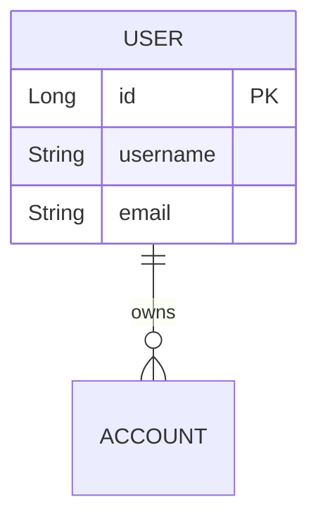
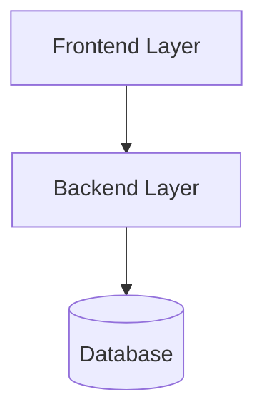
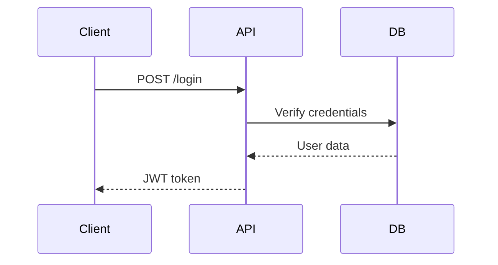

# Professional Code Analysis Report - shadcn/ui Design

## Overview

Transformed the code analysis output from a casual, emoji-filled design to a **professional, enterprise-grade report** styled after shadcn/ui design system.

## Key Changes

### 1. Agent Prompt (Kubernetes + RUN-SIMPLE.sh)

**Removed:**
- All emojis (📊, 🏗️, 📦, etc.)
- Casual language
- Decorative icons

**Added:**
- Professional business language
- Mermaid diagram requirements
- Structured section requirements
- Clean markdown formatting guidelines

**New Sections:**
```markdown
# Code Analysis Report

## Executive Summary
## Architecture Overview
## Database Schema (with Mermaid ERD)
## Domain Model
## API Endpoints
## Architecture Diagram (with Mermaid)
## Security Configuration
## Technology Stack
## Code Quality Assessment
## Migration Recommendations
```

### 2. Frontend Component (`ProfessionalCodeReport.tsx`)

**Design System: shadcn/ui inspired**

#### Color Palette
- **Background**: `bg-white` (clean white cards)
- **Borders**: `border-slate-200` (subtle gray borders)
- **Text Primary**: `text-slate-900` (dark, readable)
- **Text Secondary**: `text-slate-700` (medium gray)
- **Text Muted**: `text-slate-600` (light gray)
- **Accents**: `bg-slate-50` (very light gray for headers/footers)

#### Typography
- **H1**: `text-3xl font-bold` with bottom border
- **H2**: `text-2xl font-semibold`
- **H3**: `text-xl font-semibold`
- **Body**: `text-sm` or base, `leading-relaxed`
- **Font**: System UI font stack (professional)

#### Components

**Card Structure:**
```
┌─────────────────────────────────────────┐
│ Header (slate-50 background)           │
│ - Title: Code Analysis Report          │
│ - Subtitle: Comprehensive analysis...  │
│ - Actions: Export | Collapse           │
├─────────────────────────────────────────┤
│ Content (white background)              │
│ - Rendered markdown                     │
│ - Mermaid diagrams                      │
│ - Tables                                │
│ - Code blocks                           │
├─────────────────────────────────────────┤
│ Footer (slate-50 background)           │
│ - Generated by ARK | Timestamp         │
└─────────────────────────────────────────┘
```

**Tables:**
- Professional data tables with hover effects
- Header row with `bg-slate-50`
- Bordered cells with `border-slate-200`
- Hover state: `hover:bg-slate-50`

**Code Blocks:**
- Dark background (`bg-slate-900`)
- Light text (`text-slate-100`)
- Syntax highlighting preserved
- Overflow scroll for long code

**Mermaid Diagrams:**
- Rendered inline with `mermaid` library
- Light theme with professional colors
- Gray borders and backgrounds
- Responsive sizing

### 3. Scrollbar Styling

Changed from colorful gradient to professional gray:

**Before:**
```css
background: linear-gradient(to bottom, #8b5cf6, #6366f1); /* Violet gradient */
```

**After:**
```css
background: #cbd5e1; /* Slate-300 */
hover: #94a3b8;      /* Slate-400 */
```

### 4. Button Styling

**Professional shadcn/ui buttons:**
```jsx
<button className="px-4 py-2 text-sm font-medium text-slate-700 bg-white border border-slate-300 rounded-md hover:bg-slate-50 transition-colors">
  Export Report
</button>
```

- White background
- Gray border
- Gray text
- Subtle hover effect
- No shadows or gradients

## Features

### ✓ Mermaid Diagram Support

The report now renders Mermaid diagrams for:

**Entity Relationship Diagrams (ERD):**


**Architecture Diagrams:**


**Sequence Diagrams:**


### ✓ Professional Tables

Automatic rendering of markdown tables with:
- Header row styling
- Hover effects
- Responsive design
- Clean borders

### ✓ Export Functionality

Users can export the markdown report to a `.md` file for:
- Documentation purposes
- Sharing with team
- Version control
- Archival

## Visual Comparison

### Before (Emoji Style)
- 📊 Violet/indigo gradients
- 🎨 Colorful icons everywhere
- ✨ Shadow effects and animations
- 🔥 Playful, casual tone

### After (Professional Style)
- Clean white cards
- Subtle gray borders
- Professional typography
- Enterprise-ready presentation
- Mermaid diagrams for technical visualization
- Tables for structured data
- Export functionality

## File Changes

1. **`ark/agents/code-analyzer.yaml`** - Updated prompt (persists in Kubernetes)
2. **`RUN-SIMPLE.sh`** - Updated prompt (persists across restarts)
3. **`platform/frontend/src/components/ProfessionalCodeReport.tsx`** - New component
4. **`platform/frontend/src/components/AgentOutputVisualizer.tsx`** - Updated to use new component
5. **`platform/frontend/src/styles/globals.css`** - Professional scrollbar styling

## Usage

After running a migration, the code-analyzer agent will:

1. Analyze the codebase
2. Generate a professional markdown report with:
   - Executive summary
   - Architecture diagrams (Mermaid)
   - Database schema (ERD diagrams)
   - API endpoints (tables)
   - Security analysis
   - Recommendations
3. Display it in a clean, shadcn/ui styled card
4. Allow export to markdown file

## Testing

```bash
# Start the platform
./RUN-SIMPLE.sh

# Navigate to http://localhost:3000
# Start a migration
# Click on "Code Analysis" agent
# View the professional report with diagrams
```

## Design Principles Applied

✓ **Minimalism** - Only essential elements, no decorative icons
✓ **Hierarchy** - Clear visual hierarchy with typography
✓ **Consistency** - Uniform spacing, borders, and colors
✓ **Accessibility** - High contrast text, readable fonts
✓ **Professionalism** - Enterprise-ready appearance
✓ **Functionality** - Diagrams, tables, export features

## Result

A **professional, enterprise-grade code analysis report** that:
- Looks like it belongs in a Fortune 500 company
- Provides visual diagrams for architecture understanding
- Uses clean, modern design principles
- Supports data visualization with tables and charts
- Exports easily for documentation and sharing
- Follows shadcn/ui design language (the gold standard for React UIs)
