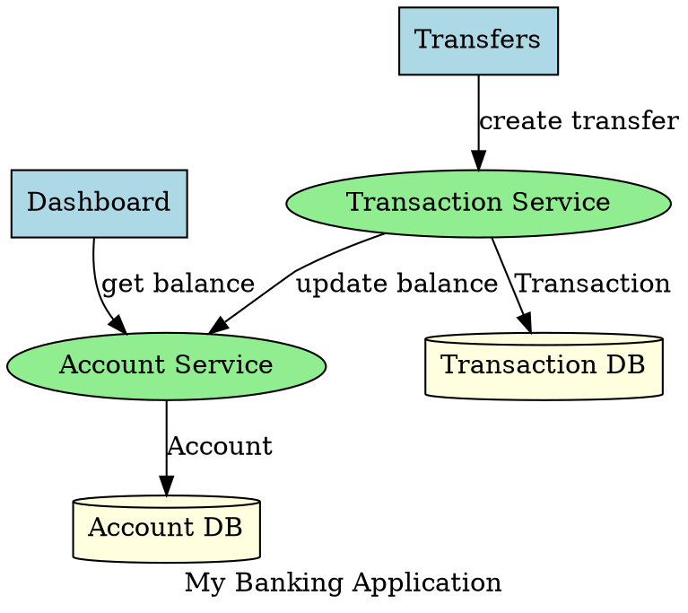
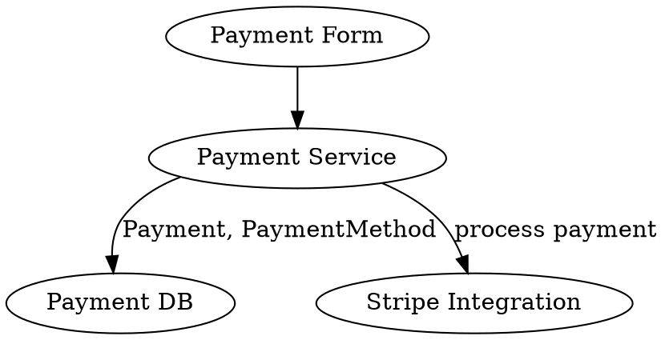

# 🏦 DOT Architecture Migration System

## ✨ What You Have Now

I've created a complete system that lets you define your banking application architecture in a DOT file and automatically generate:

- ✅ **Spring Boot Microservices** (Java 17, Spring Boot 3.2)
- ✅ **Angular Micro-Frontends** (Angular 18 with Module Federation)
- ✅ **PostgreSQL Databases** (one per service)
- ✅ **Docker Deployment** (docker-compose ready)
- ✅ **API Gateway** configuration
- ✅ **Complete Documentation**

---

## 🚀 Quick Start (3 Commands)

### 1. Start Backend (if not already running)
```bash
cd platform/backend && npm run dev
```

### 2. Run the Example Migration
```bash
./migrate-from-dot.sh examples/banking-architecture.dot
```

### 3. Open Your App
```bash
# Main application
open http://localhost:4200

# Or visit:
#   Dashboard: http://localhost:4202
#   Transfers: http://localhost:4203
#   Cards: http://localhost:4204
```

---

## 📁 What Was Created

### New Files

```
banque-app-transformed/
├── migrate-from-dot.sh              # Main migration script
├── QUICK-START-DOT.md               # Quick reference guide
├── DOT-MIGRATION-GUIDE.md           # Complete documentation
├── examples/
│   └── banking-architecture.dot     # Example architecture
└── platform/backend/src/
    ├── services/
    │   └── dotArchitectureParser.ts # DOT file parser
    └── routes/
        └── dotMigrationRoutes.ts    # API endpoints
```

### Dependencies Installed
- ✅ multer (file upload)
- ✅ js-yaml (YAML generation)
- ✅ @types/multer (TypeScript types)

---

## 📝 How to Use Your Own Architecture

### Step 1: Create a DOT File

Create `my-banking-app.dot`:



### Step 2: Run Migration

```bash
./migrate-from-dot.sh my-banking-app.dot
```

### Step 3: Access Generated Code

```bash
# Find your migration ID
ls -lt platform/backend/workspace/ | head -2

# View generated code
cd platform/backend/workspace/<migration-id>/output/

# See what was created
tree -L 2
```

---

## 🎯 Generated Architecture

For the example (`banking-architecture.dot`), you get:

### 5 Microservices
1. **auth-service** (Port 8081) - Authentication & Authorization
2. **client-service** (Port 8082) - Client Management
3. **account-service** (Port 8083) - Account Management
4. **transaction-service** (Port 8084) - Transaction Processing
5. **card-service** (Port 8085) - Card Management

### 5 Micro-Frontends
1. **shell** (Port 4200) - Main shell with navigation
2. **auth-mfe** (Port 4201) - Login/Register
3. **dashboard-mfe** (Port 4202) - Dashboard & Overview
4. **transfers-mfe** (Port 4203) - Money Transfers
5. **cards-mfe** (Port 4204) - Card Management

### 5 Databases
- PostgreSQL instances (Ports 5432-5436)

### 1 API Gateway
- Port 8080 - Routes to all microservices

---

## 🔌 API Endpoints

Once your backend is running:

### Upload DOT File
```bash
curl -X POST \
  -F "dotFile=@your-architecture.dot" \
  http://localhost:4000/api/dot-migration/upload
```

### Generate and Deploy (All-in-One)
```bash
curl -X POST \
  -F "dotFile=@your-architecture.dot" \
  http://localhost:4000/api/dot-migration/generate-and-deploy
```

---

## 🛠️ Customization

### Modify Parser Logic
Edit `platform/backend/src/services/dotArchitectureParser.ts` to:
- Add custom entity fields
- Change naming conventions
- Add new node types
- Customize code generation

### Modify Templates
Edit the generators:
- **Spring Boot**: `platform/backend/src/generators/SpringBootServiceGenerator.ts`
- **Angular**: `platform/backend/src/generators/AngularMicroFrontendGenerator.ts`

---

## 📊 Example DOT Syntax

### Define a Complete Service Stack



---

## 🐛 Troubleshooting

### Backend Won't Start
```bash
cd platform/backend
npm install
npm run dev
```

### Port Already in Use
```bash
# Find process
sudo lsof -i :4000

# Kill it
kill -9 <PID>
```

### Docker Issues
```bash
# Check Docker status
sudo systemctl status docker

# Start Docker
sudo systemctl start docker

# View logs
docker logs <container-name>
```

### Dependencies Missing
```bash
cd platform/backend
npm install multer @types/multer js-yaml
```

---

## 📚 Documentation

- **Quick Start**: `QUICK-START-DOT.md` - Get started in 5 minutes
- **Full Guide**: `DOT-MIGRATION-GUIDE.md` - Complete documentation
- **Example**: `examples/banking-architecture.dot` - Full banking app example

---

## 🎓 Learning Path

1. **Try the Example**
   ```bash
   ./migrate-from-dot.sh examples/banking-architecture.dot
   ```

2. **View Generated Code**
   ```bash
   ls platform/backend/workspace/*/output/
   ```

3. **Customize the DOT File**
   - Add your own services
   - Define custom routes
   - Specify API endpoints

4. **Re-run Migration**
   ```bash
   ./migrate-from-dot.sh your-custom.dot
   ```

5. **Modify Generated Code**
   - Add business logic
   - Customize UI components
   - Implement real authentication

---

## 💡 Pro Tips

1. **Start Small**: Begin with 2-3 services, expand gradually
2. **Use Descriptive Names**: Clear labels help code generation
3. **Group Related Features**: Keep related services together
4. **Document Connections**: Use edge labels to describe interactions
5. **Test Incrementally**: Generate one service at a time initially

---

## 🔄 Workflow

```
Your DOT File
     ↓
Parser extracts architecture
     ↓
Migration plan generated
     ↓
Code generators create:
  • Spring Boot services
  • Angular frontends
  • Docker configs
     ↓
Deployment to Docker
     ↓
Running Application! 🎉
```

---

## 🚦 Status Check

```bash
# Check backend
curl http://localhost:4000/health

# Check frontend
curl http://localhost:3000

# Check running containers
docker ps

# View all migrations
ls platform/backend/workspace/
```

---

## 🎯 Next Steps

1. ✅ Backend is running (check with `curl http://localhost:4000/health`)
2. ✅ Try the example: `./migrate-from-dot.sh examples/banking-architecture.dot`
3. ✅ Create your own architecture
4. ✅ Generate your application
5. ✅ Customize and deploy

---

## 🆘 Need Help?

### Check Logs
```bash
# Backend logs
tail -f logs/backend.log

# Docker logs
docker logs shell-<migration-id>

# Migration logs
tail -f platform/backend/logs/combined.log
```

### Common Issues
- **Port in use**: Change ports in DOT file or stop conflicting services
- **Docker not running**: `sudo systemctl start docker`
- **Backend errors**: Check `logs/backend.log`

---

**🎉 You're all set! Start migrating with:**

```bash
./migrate-from-dot.sh examples/banking-architecture.dot
```

**Questions? Check:**
- `QUICK-START-DOT.md` for quick reference
- `DOT-MIGRATION-GUIDE.md` for detailed docs
- `examples/banking-architecture.dot` for syntax examples
