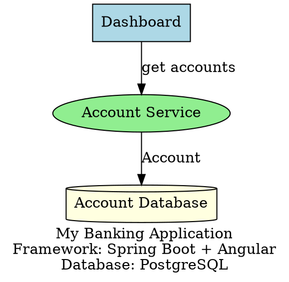
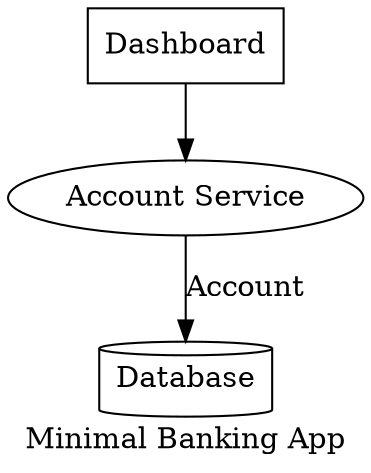
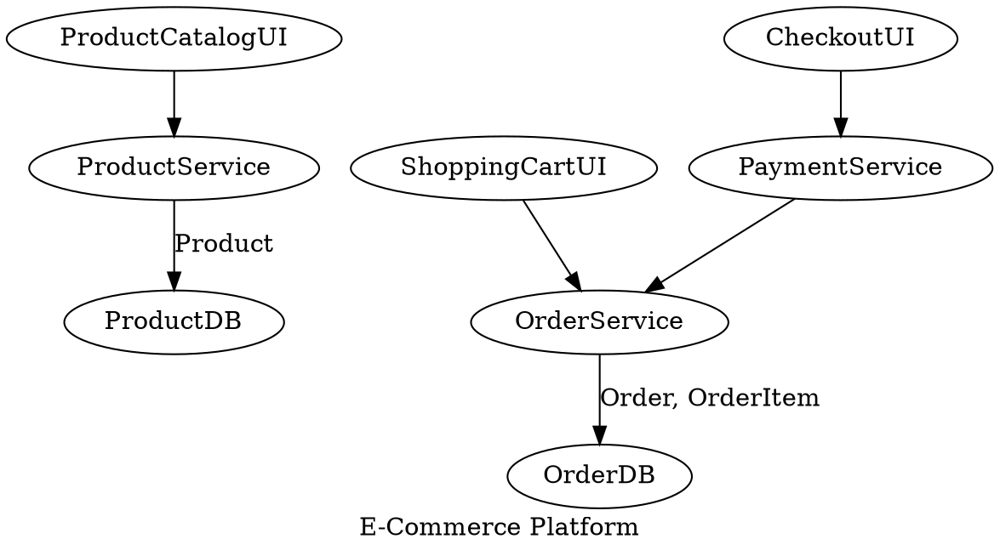

# DOT Architecture Migration Guide

This guide explains how to use DOT (Graphviz) architecture files to automatically generate microservices and micro-frontends.

## Overview

The DOT Migration Tool allows you to:
1. Define your application architecture in a DOT file
2. Automatically generate Spring Boot microservices
3. Automatically generate Angular 18 micro-frontends with Module Federation
4. Deploy everything with Docker

## Quick Start

### Step 1: Create Your DOT Architecture File

Create a `.dot` file describing your application architecture. See `examples/banking-architecture.dot` for a complete example.



### Step 2: Run the Migration

```bash
./migrate-from-dot.sh your-architecture.dot
```

Or use the provided example:

```bash
./migrate-from-dot.sh examples/banking-architecture.dot
```

### Step 3: Access Your Applications

After successful migration:
- **Shell Application**: http://localhost:4200
- **Dashboard**: http://localhost:3000
- **API Gateway**: http://localhost:8080

## DOT File Structure

### Node Types

Define nodes with different types using attributes:

#### 1. UI Components (Micro-Frontends)

```dot
node [shape=box, style=filled, fillcolor=lightblue];
DashboardUI [
  label="Dashboard UI",
  type="component",
  routes="/dashboard,/overview",
  components="DashboardMain,StatisticsCard,RecentTransactions"
];
```

**Attributes:**
- `type="component"` - Marks as a UI component
- `routes` - Comma-separated list of routes
- `components` - Comma-separated list of sub-components to generate

#### 2. Backend Services (Microservices)

```dot
node [shape=ellipse, style=filled, fillcolor=lightgreen];
AccountService [
  label="Account Service",
  type="service",
  endpoints="GET /accounts, POST /accounts, GET /accounts/:id"
];
```

**Attributes:**
- `type="service"` - Marks as a backend service
- `endpoints` - Comma-separated list of API endpoints (optional)

#### 3. Databases

```dot
node [shape=cylinder, style=filled, fillcolor=lightyellow];
AccountDB [label="Account DB", type="database"];
```

**Attributes:**
- `type="database"` - Marks as a database

### Edges (Connections)

Define relationships between components:

```dot
// UI to Service
DashboardUI -> AccountService [label="fetch data"];

// Service to Database
AccountService -> AccountDB [label="Account, Transaction"];

// Service to Service
TransactionService -> AccountService [label="validate account"];
```

**Edge Labels:**
- For Service → Database: Comma-separated list of entity names
- For UI → Service or Service → Service: Description of the interaction

## Generated Architecture

From your DOT file, the tool generates:

### Microservices (Spring Boot 3.2)
- Complete Spring Boot projects
- JPA entities based on database connections
- REST controllers with CRUD endpoints
- Service layer with business logic
- Repository interfaces
- Docker configuration
- pom.xml with all dependencies

### Micro-Frontends (Angular 18)
- Complete Angular projects
- Module Federation configuration
- Routing setup
- Components based on your specification
- Services for API communication
- Docker configuration with Nginx
- package.json with all dependencies

### Infrastructure
- `docker-compose.yml` for easy deployment
- PostgreSQL databases for each service
- Nginx configuration
- README with getting started guide

## Advanced Features

### Custom Entity Fields

The tool intelligently generates entity fields based on common banking patterns:

- **Account** → accountNumber, balance, accountType, status
- **Transaction** → amount, type, description, date
- **Card** → cardNumber, type, expiryDate, cvv
- **Client** → firstName, lastName, email, phone
- **User** → username, email, firstName, lastName

### Automatic Routing

For micro-frontends marked as `isHost=true`, the tool automatically:
- Creates a shell application
- Configures Module Federation
- Sets up routing to all remote modules
- Generates navigation menu

## Example: Complete Banking Application

See `examples/banking-architecture.dot` for a full example with:
- 5 microservices (Auth, Client, Account, Transaction, Card)
- 4 micro-frontends + shell
- Complete database schema
- Inter-service communication

## API Endpoints

### Upload DOT File (Manual)

```bash
curl -X POST \
  -F "dotFile=@your-architecture.dot" \
  http://localhost:4000/api/dot-migration/upload
```

### Generate Code Only

```bash
curl -X POST \
  -H "Content-Type: application/json" \
  -d @migration-plan.json \
  http://localhost:4000/api/dot-migration/generate
```

### Generate and Deploy

```bash
curl -X POST \
  -F "dotFile=@your-architecture.dot" \
  http://localhost:4000/api/dot-migration/generate-and-deploy
```

## Troubleshooting

### Backend Not Running

```bash
cd platform/backend
npm run dev
```

### Docker Containers Not Starting

```bash
# Check Docker status
sudo docker ps

# View logs
docker logs <container-name>

# Restart deployment
./migrate-from-dot.sh your-architecture.dot
```

### Dependencies Missing

```bash
cd platform/backend
npm install multer @types/multer js-yaml
```

## Best Practices

1. **Start Small**: Begin with 2-3 services and expand
2. **Clear Labels**: Use descriptive names for services and components
3. **Group Related Services**: Keep related functionality together
4. **Document Connections**: Use edge labels to describe interactions
5. **Test Incrementally**: Generate and test one service at a time

## Customization

### Modify Generated Code

Generated code is located in:
```
platform/backend/workspace/<migration-id>/output/
├── microservices/
│   ├── auth-service/
│   ├── client-service/
│   └── ...
└── micro-frontends/
    ├── shell/
    ├── auth-mfe/
    └── ...
```

You can modify the generated code and rebuild:

```bash
cd platform/backend/workspace/<migration-id>/output
docker-compose up --build
```

### Extend the Parser

Edit `platform/backend/src/services/dotArchitectureParser.ts` to add:
- Custom entity field generation
- New node types
- Additional metadata parsing
- Custom code templates

## Examples

### Minimal Application



### E-Commerce Application



## Next Steps

1. Try the example: `./migrate-from-dot.sh examples/banking-architecture.dot`
2. Create your own architecture file
3. Customize the generated code
4. Add business logic
5. Deploy to production

## Support

For issues or questions:
- Check logs: `logs/` directory
- View Docker logs: `docker logs <container>`
- Backend logs: `platform/backend/logs/`

---

**Generated by Banking Migration Platform**
