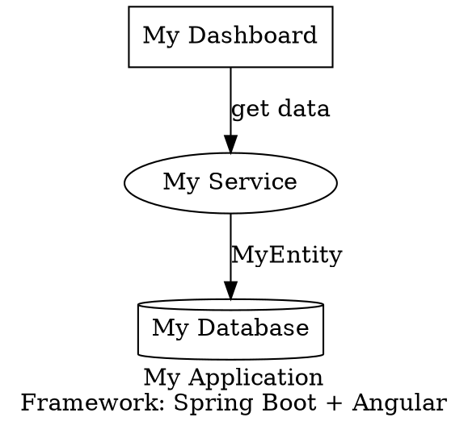

# Quick Start: DOT Architecture Migration

## 🚀 Generate Your Banking App in 3 Steps

### 1️⃣ View the Example Architecture

```bash
cat examples/banking-architecture.dot
```

This shows a complete banking app with:
- 🏦 5 Microservices (Auth, Client, Account, Transaction, Card)
- 🎨 4 Micro-Frontends + Shell
- 🗄️ 5 PostgreSQL Databases
- 🔗 Complete service mesh

### 2️⃣ Run the Migration

```bash
./migrate-from-dot.sh examples/banking-architecture.dot
```

This will:
- ✅ Parse your architecture
- ✅ Generate Spring Boot microservices
- ✅ Generate Angular micro-frontends
- ✅ Deploy with Docker
- ✅ Configure networking

### 3️⃣ Access Your App

**Open in your browser:**
- 🏠 Shell (Main App): http://localhost:4200
- 📊 Dashboard: http://localhost:4202
- 💸 Transfers: http://localhost:4203
- 💳 Cards: http://localhost:4204
- 🔐 Auth: http://localhost:4201
- 🌐 API Gateway: http://localhost:8080

---

## 📝 Create Your Own Architecture

### Basic Template



Save as `my-app.dot` and run:

```bash
./migrate-from-dot.sh my-app.dot
```

---

## 🎯 What Gets Generated?

### For Each Service Node:
```
microservices/my-service/
├── src/main/java/com/eurobank/myservice/
│   ├── entity/
│   │   └── MyEntity.java
│   ├── repository/
│   │   └── MyEntityRepository.java
│   ├── service/
│   │   └── MyEntityService.java
│   └── controller/
│       └── MyEntityController.java
├── pom.xml
└── Dockerfile
```

### For Each Component Node:
```
micro-frontends/my-ui-mfe/
├── src/
│   ├── app/
│   │   ├── app.component.ts
│   │   ├── app.module.ts
│   │   └── app.routes.ts
│   └── index.html
├── webpack.config.js (Module Federation)
├── package.json
└── Dockerfile
```

---

## 🔧 Common Tasks

### View Running Containers

```bash
docker ps
```

### View Logs

```bash
# Shell application
docker logs shell-<migration-id>

# Any service
docker logs <service-name>
```

### Stop All Containers

```bash
docker stop $(docker ps -q)
```

### Rebuild After Changes

```bash
cd platform/backend/workspace/<migration-id>/output
docker-compose up --build
```

---

## 💡 Tips

### Add More UI Routes

```dot
MyUI [
  label="Dashboard",
  type="component",
  routes="/dashboard,/overview,/settings"
];
```

### Add API Endpoints

```dot
MyService [
  label="User Service",
  type="service",
  endpoints="GET /users, POST /users, DELETE /users/:id"
];
```

### Define Custom Components

```dot
DashboardUI [
  label="Dashboard",
  type="component",
  routes="/dashboard",
  components="StatsCard,TransactionList,QuickActions"
];
```

### Link Services Together

```dot
TransactionService -> AccountService [label="validate account"];
CardService -> AccountService [label="link to account"];
```

---

## ❓ Troubleshooting

### "Backend server is not running"

```bash
cd platform/backend
npm run dev
```

### "Docker not available"

```bash
sudo systemctl start docker
```

### Port Already in Use

```bash
# Find process using port 4200
sudo lsof -i :4200

# Kill it
sudo kill -9 <PID>
```

---

## 📚 Full Documentation

See `DOT-MIGRATION-GUIDE.md` for complete details on:
- Advanced DOT syntax
- Custom entity fields
- Inter-service communication
- Deployment options
- Code customization

---

**Ready to migrate? Run:**
```bash
./migrate-from-dot.sh examples/banking-architecture.dot
```
