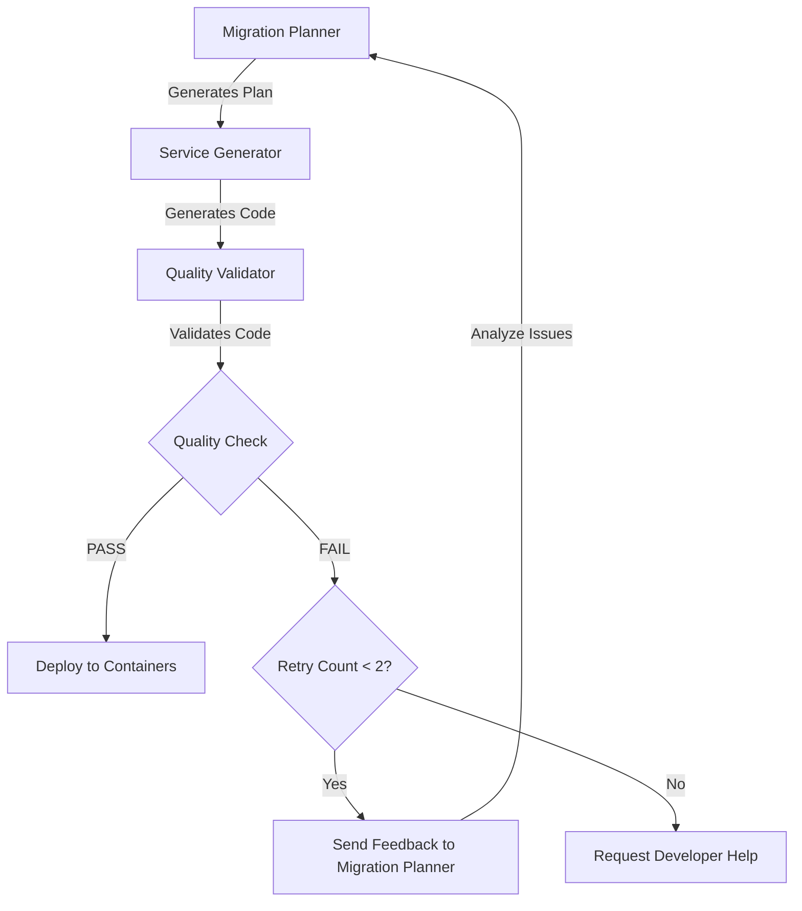

# Migration Agent Improvements

## Summary of Changes

This document describes the improvements made to the migration platform's agent system, specifically focusing on the migration planner agent, quality feedback loop, and interactive developer assistance.

---

## 1. **Fixed Migration Planner Model**

### Problem
The migration planner agent was configured to use `claude-opus-4-5`, which doesn't exist.

### Solution
Updated the migration planner configuration to use the correct model:

**File:** `ark/agents/migration-planner.yaml`

```yaml
model:
  provider: anthropic
  model: claude-opus-4-6  # ✅ Fixed from claude-opus-4-5
```

**Benefits:**
- Migration planner now uses the most powerful Claude model (Opus 4.6)
- Better architectural decisions
- More accurate code generation planning
- Improved error handling

---

## 2. **Quality Validator Feedback Loop**

### Problem
When quality validation failed, the migration would simply fail without attempting to fix the issues. There was no feedback loop from the quality validator back to the migration planner.

### Solution
Implemented an intelligent feedback loop that allows the migration planner to learn from quality validation failures and regenerate improved code.

**How It Works:**



**Implementation:**

1. **Quality Validator sends feedback** when validation fails:
   - Build errors (backend/frontend)
   - Code quality issues
   - Security vulnerabilities
   - Missing entities/endpoints
   - Configuration problems

2. **Migration Planner receives feedback** and:
   - Analyzes validation report
   - Identifies root causes
   - Adjusts migration strategy
   - Regenerates improved plan

3. **Code is regenerated** with fixes:
   - Service generator creates new microservices
   - Frontend migrator creates new micro-frontends
   - Quality validator re-validates

4. **Maximum 2 retry attempts** to avoid infinite loops

**File Changes:**

- `platform/backend/src/services/migrationService.ts`:
  - Added `rerunMigrationPlannerWithFeedback()` method
  - Added `generateRecommendationsFromValidation()` method
  - Added `regenerateCodeWithNewPlan()` method
  - Updated quality-validator agent logic to trigger feedback loop

**Example Feedback:**

```json
{
  "validationStatus": "fail",
  "buildIssues": {
    "backend": true,
    "frontend": false
  },
  "codeQualityIssues": [
    {
      "severity": "high",
      "category": "security",
      "message": "Hardcoded password detected",
      "file": "src/main/java/config/DatabaseConfig.java"
    }
  ],
  "recommendations": [
    "Use correct Java version (17+) and Spring Boot dependencies",
    "Fix Maven pom.xml configuration",
    "Address 3 critical code quality issues"
  ]
}
```

---

## 3. **Interactive Developer Assistance**

### Problem
When agents encounter problems they cannot solve automatically, there was no way for them to ask a human developer for help. The migration would just fail.

### Solution
Implemented a bidirectional communication system that allows agents to request help from developers and receive guidance.

**How It Works:**

1. **Agent encounters an unsolvable problem**:
   - Maximum retries reached
   - Ambiguous requirements
   - External dependencies unavailable
   - Unexpected errors

2. **Agent requests developer help**:
   - Describes the issue
   - Provides context (validation reports, error logs, etc.)
   - Asks specific questions
   - Suggests possible solutions

3. **Developer receives notification**:
   - Real-time WebSocket notification
   - Detailed issue description
   - Full context for informed decision

4. **Developer responds**:
   - Provides guidance
   - Chooses action: `continue`, `retry`, `skip`, or `abort`
   - Agent receives response and proceeds accordingly

**New API Endpoints:**

#### 1. Agent Help Request
```bash
POST /api/chat/migrations/:migrationId/agent-help
```

**Request:**
```json
{
  "agentName": "migration-planner",
  "issue": "Quality validation keeps failing after multiple attempts",
  "context": {
    "retryCount": 2,
    "validationReport": { /* full report */ },
    "lastIssues": [ /* top 5 issues */ ]
  },
  "question": "What should I do? Should I:\n1. Try a different migration strategy?\n2. Simplify the target architecture?\n3. Skip quality validation and proceed?\n4. Abort the migration?"
}
```

**Response:**
```json
{
  "success": true,
  "message": "Help request sent to developer",
  "helpRequestId": "migration-123",
  "status": "pending"
}
```

#### 2. Developer Response
```bash
POST /api/chat/migrations/:migrationId/agent-help/respond
```

**Request:**
```json
{
  "response": "Try simplifying the architecture by combining the auth-service and user-service",
  "action": "retry"  // Options: continue, retry, skip, abort
}
```

**Response:**
```json
{
  "success": true,
  "message": "Response sent to agent",
  "action": "retry"
}
```

#### 3. Get Pending Help Requests
```bash
GET /api/chat/migrations/:migrationId/agent-help
```

**Response:**
```json
{
  "success": true,
  "helpRequest": {
    "migrationId": "migration-123",
    "agentName": "migration-planner",
    "issue": "Quality validation keeps failing",
    "context": { /* ... */ },
    "question": "What should I do?",
    "timestamp": "2024-01-15T10:30:00Z",
    "status": "pending"
  }
}
```

**WebSocket Events:**

- `agent-needs-help`: Emitted when agent requests help
- `developer-response`: Emitted when developer responds
- `agent-progress`: Updated with help request status

**File Changes:**

- `platform/backend/src/routes/chatRoutes.ts`:
  - Added `/agent-help` endpoint
  - Added `/agent-help/respond` endpoint
  - Added `/agent-help` GET endpoint

- `platform/backend/src/services/migrationService.ts`:
  - Added `requestDeveloperHelp()` method
  - Integrated help requests when max retries reached

---

## 4. **Updated Agent Configuration**

**File:** `ark/agents/migration-planner.yaml`

Added new tools for feedback and interaction:

```yaml
tools:
  - name: openapi-generator
    type: builtin
    description: Generate OpenAPI 3.0 specifications

  - name: schema-generator
    type: builtin
    description: Generate database schemas from entities

  - name: validation-feedback  # ✨ NEW
    type: builtin
    description: Receive feedback from quality validator and adjust plan

  - name: chat-interface  # ✨ NEW
    type: builtin
    description: Interactive chat with developer for clarifications
```

Updated system prompt:

```yaml
systemPrompt: |
  You are a software architect specializing in microservices and micro-frontends.
  You work in an iterative mode where you can receive feedback from quality validation
  and adjust your migration plan accordingly. When validation fails, analyze the feedback
  and regenerate an improved migration plan.
  # ... rest of prompt
```

---

## Usage Examples

### Example 1: Quality Feedback Loop

**Scenario:** Backend build fails due to incorrect Java version

1. **Quality Validator detects issue:**
```
❌ Backend Build Failed
- Error: Java version 11 detected, but Spring Boot 3.x requires Java 17+
```

2. **Feedback sent to Migration Planner:**
```json
{
  "buildIssues": { "backend": true },
  "recommendations": [
    "Use correct Java version (17+) and Spring Boot dependencies"
  ]
}
```

3. **Migration Planner regenerates plan:**
```
✅ Migration Plan Regenerated

🔄 Adjustments Made:
- Updated pom.xml to require Java 17
- Changed Spring Boot version to 3.2.2
- Updated all Spring dependencies

✨ New plan ready for code generation!
```

4. **Code regenerated and validated:**
```
✅ Backend Build: SUCCESS
✅ Quality Validation: PASSED
```

### Example 2: Developer Assistance

**Scenario:** Migration planner fails after 2 retries

1. **Agent requests help:**
```
🆘 migration-planner needs help!

Issue: Quality validation keeps failing after multiple attempts

Question: What should I do? Should I:
1. Try a different migration strategy?
2. Simplify the target architecture?
3. Skip quality validation and proceed?
4. Abort the migration?

Context:
{
  "retryCount": 2,
  "lastIssues": [
    "Missing entities: UserProfile, Settings",
    "Build failed: TypeScript compilation errors"
  ]
}
```

2. **Developer reviews and responds:**
```json
{
  "response": "The UserProfile and Settings entities are optional. Simplify by removing them and focus on core banking entities only.",
  "action": "retry"
}
```

3. **Agent receives guidance and retries:**
```
✅ Received developer guidance
- Removing optional entities: UserProfile, Settings
- Focusing on core banking entities
- Regenerating simplified migration plan...
```

---

## Benefits

### 1. **Improved Success Rate**
- Automatic error detection and correction
- Self-healing migration process
- Fewer manual interventions required

### 2. **Better Code Quality**
- Iterative refinement based on validation feedback
- Addresses security and quality issues automatically
- Produces production-ready code

### 3. **Developer Efficiency**
- Agents handle routine issues automatically
- Developer only involved for complex decisions
- Clear context provided when help is needed

### 4. **Transparency**
- Real-time WebSocket updates
- Detailed progress tracking
- Full audit trail of decisions and changes

### 5. **Reliability**
- Prevents infinite loops with retry limits
- Graceful degradation when help is needed
- Human-in-the-loop for critical decisions

---

## Testing the Features

### Test Quality Feedback Loop

1. Start a migration
2. Wait for quality validator to complete
3. If validation fails, watch the migration planner receive feedback
4. Observe code regeneration with fixes
5. See quality validator re-validate

### Test Developer Assistance

1. Start a migration that will fail (e.g., with incompatible dependencies)
2. Wait for maximum retries to be reached
3. Check WebSocket events for help request notification
4. Use API to respond to help request:

```bash
curl -X POST http://localhost:4000/api/chat/migrations/YOUR_MIGRATION_ID/agent-help/respond \
  -H "Content-Type: application/json" \
  -d '{
    "response": "Try simplifying the architecture",
    "action": "retry"
  }'
```

5. Watch agent receive response and proceed

---

## Future Enhancements

1. **Multi-Agent Collaboration**
   - Agents can ask other agents for help
   - Peer review system between agents

2. **Learning from Past Migrations**
   - Store successful migration patterns
   - Apply learned patterns to new migrations

3. **Advanced Developer UI**
   - Rich chat interface for agent communication
   - Code diff viewer for feedback loop changes
   - Interactive decision trees

4. **Automated Issue Resolution**
   - AI-powered root cause analysis
   - Automatic application of known fixes
   - Pattern matching for common issues

---

## Troubleshooting

### Migration Planner Not Working

**Check:** Model configuration
```bash
cat ark/agents/migration-planner.yaml | grep "model:"
```

**Expected:** `model: claude-opus-4-6`

### Feedback Loop Not Triggering

**Check:** Validation report status
```bash
# In migration service logs
grep "Quality validation completed with status" logs/migration.log
```

**Expected:** Status should be 'fail' to trigger feedback

### Help Requests Not Received

**Check:** WebSocket connection
```bash
# In browser console
ws.readyState === 1  // OPEN
```

**Check:** Help requests storage
```javascript
// In Node.js console (backend)
console.log(global.agentHelpRequests);
```

---

## Configuration

### Environment Variables

No new environment variables required. The system uses existing configuration.

### Agent Configuration

**Migration Planner:** `ark/agents/migration-planner.yaml`
- Model: `claude-opus-4-6`
- Tools: `validation-feedback`, `chat-interface`

**Quality Validator:** `ark/agents/quality-validator.yaml`
- Model: `claude-sonnet-4-5` (kept as is - Sonnet is sufficient for validation)

---

## Architecture Diagram

```
┌─────────────────────────────────────────────────────────────────┐
│                         Developer UI                              │
│  ┌───────────────┐  ┌───────────────┐  ┌───────────────┐       │
│  │  Dashboard    │  │  Chat Panel   │  │  Help Alerts  │       │
│  └───────┬───────┘  └───────┬───────┘  └───────┬───────┘       │
│          │                  │                  │                 │
└──────────┼──────────────────┼──────────────────┼─────────────────┘
           │                  │                  │
           │  WebSocket      │  REST API        │  WebSocket
           │                  │                  │
┌──────────▼──────────────────▼──────────────────▼─────────────────┐
│                       Backend Server                              │
│  ┌─────────────────────────────────────────────────────────┐    │
│  │              Migration Service                           │    │
│  │  ┌───────────────────────────────────────────────────┐  │    │
│  │  │  Agent Orchestration Engine                       │  │    │
│  │  │  - Manages agent lifecycle                        │  │    │
│  │  │  - Handles feedback loops                         │  │    │
│  │  │  - Coordinates developer help requests            │  │    │
│  │  └───────────────────────────────────────────────────┘  │    │
│  └─────────────────────────────────────────────────────────┘    │
│                                                                   │
│  ┌──────────────┐  ┌──────────────┐  ┌──────────────┐          │
│  │ Migration    │  │ Service      │  │ Quality      │          │
│  │ Planner      │◄─┤ Generator    │◄─┤ Validator    │          │
│  │              │  │              │  │              │          │
│  │ Opus 4.6     │  │ Sonnet 4.5   │  │ Sonnet 4.5   │          │
│  └──────┬───────┘  └──────────────┘  └──────┬───────┘          │
│         │                                     │                  │
│         │ ◄───────── Feedback ────────────────┘                  │
│         │                                                        │
│         └─────────────► Help Request ─────────► Developer       │
│                                                                   │
└───────────────────────────────────────────────────────────────────┘
```

---

## Conclusion

These improvements transform the migration platform from a simple code generator into an intelligent, self-correcting system that can:

1. **Learn from failures** and automatically improve
2. **Seek human guidance** when stuck
3. **Provide transparency** into decision-making
4. **Deliver higher quality** code through iterative refinement

The migration planner now uses the most powerful Claude model (Opus 4.6) and can intelligently collaborate with both other agents and human developers to ensure successful migrations.

---

## Questions or Issues?

If you encounter any problems or have questions about these features, please:

1. Check the troubleshooting section above
2. Review the logs in `platform/backend/logs/`
3. Inspect WebSocket events in browser DevTools
4. Contact the development team for assistance

**Happy Migrating! 🚀**
